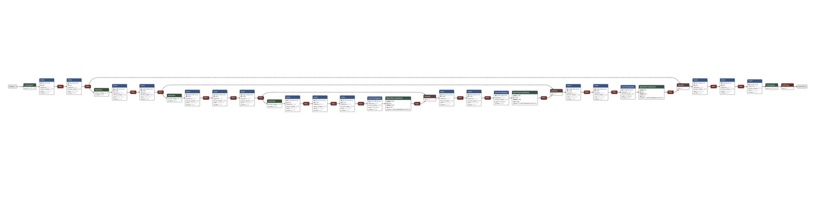

# Keras Unet Model
Этот каталог содержит модель для сегментации, реализованную с использованием Keras.

Для генерации данных используйте следующую команду:
```bash
python generate_data.py
```

Данные будут сохранены в папке **data**.

Для генерации модели ONNX используйте следующую команду:
```bash
python model.py
```
После генерации модели вы можете просмотреть её описание и архитектуру с помощью пакета **netron**.



Команда для запуска инференса:
```bash
node inference.js
```

Результаты будут отображены в консоли.