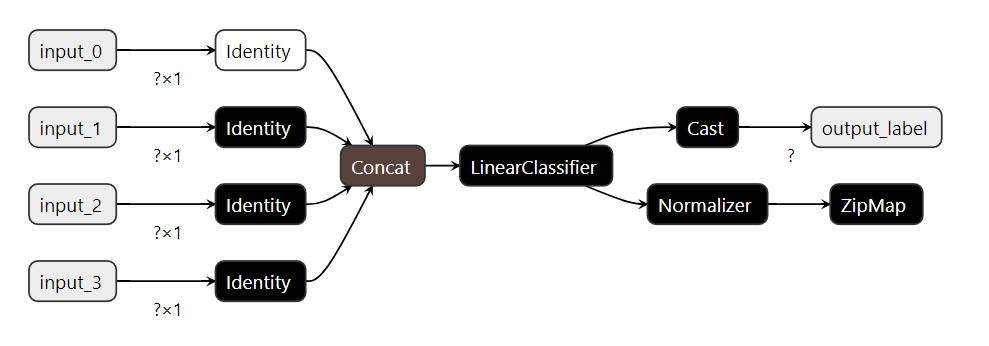

# Sklearn Linear
Этот каталог содержит модель линейной регрессии, реализованную с использованием Scikit-learn.

Для генерации данных используйте следующую команду:
```bash
python generate_data.py
```

Данные будут сохранены в папке **data**.

Для генерации модели ONNX используйте следующую команду:
```bash
python model.py
```

Процесс добавления специальных входов в файл `model.py` включает создание нескольких узлов в графе модели ONNX. Это необходимо, потому что по умолчанию scikit-learn создаёт модель с одним входом, который принимает все признаки сразу при импорте в ONNX. Такую модель можно использовать, но можно выполнить преобразование к распространенному способу подачи данных в модель. В этом случае добавляется несколько узлов в граф модели. Вот шаги:

1. Определите количество признаков в ваших тренировочных данных. Это можно сделать, проверив форму тренировочных данных. В данном случае, `x_train.shape[1]` даст количество признаков.
2. Создайте узел 'Identity' для каждого признака. Каждый узел принимает вход и выдаёт выход. Вход называется 'input_i', а выход — 'output_i', где 'i' — индекс признака.

```python
nodes = [
    helper.make_node(
        'Identity',
        inputs=['input_{}'.format(i)],
        outputs=['output_{}'.format(i)],
    ) for i in range(x_train.shape[1])
]
```

3. Создайте узел 'Concat', который объединяет выходы узлов 'Identity' в один вход. Это делается путём указания выходов узлов 'Identity' как входов для узла 'Concat'. Выход узла 'Concat' называется 'float_input'.

```python
concat_node = helper.make_node(
    'Concat',
    inputs=['output_{}'.format(i) for i in range(x_train.shape[1])],
    outputs=['float_input'],
    axis=1
)
```

4. Создайте граф, который включает узлы 'Identity' и узел 'Concat'. Граф принимает узлы 'Identity' в качестве входов, а выход ONNX модели — как выход.

```python
graph_def = helper.make_graph(
    nodes + [concat_node],
    'IdentityTransform',
    [helper.make_tensor_value_info('input_{}'.format(i), TensorProto.FLOAT, [None, 1]) for i in range(x_train.shape[1])], # Входы графа
    [onx.graph.output[0]],
)
```

5. Добавьте граф в модель ONNX. Это делается путём расширения узлов модели ONNX узлами графа.

```python
graph_def.node.extend(onx.graph.node)
```

6. Создайте новую модель ONNX, которая включает граф. Это делается с помощью функции `helper.make_model`.

```python
onx = helper.make_model(graph_def, producer_name='onnx-example')
```

После генерации модели вы можете просмотреть её описание и архитектуру с помощью пакета **netron**.



Для запуска инференса модели используйте следующую команду:
```bash
node inference.js
```

Результаты будут отображены в консоли.