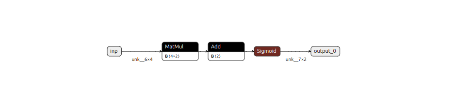

# Tensorflow Dense
Этот каталог содержит модель, состоящую только из одного Dense слоя, определённого вручную.

Чтобы сгенерировать модель ONNX, используйте следующую команду:
```bash
python model.py
```
После генерации модели вы можете просмотреть её описание и архитектуру с помощью пакета **netron**.



Для запуска инференса используйте следующую команду:
```bash
node inference.js
```

Результаты будут отображены в консоли.